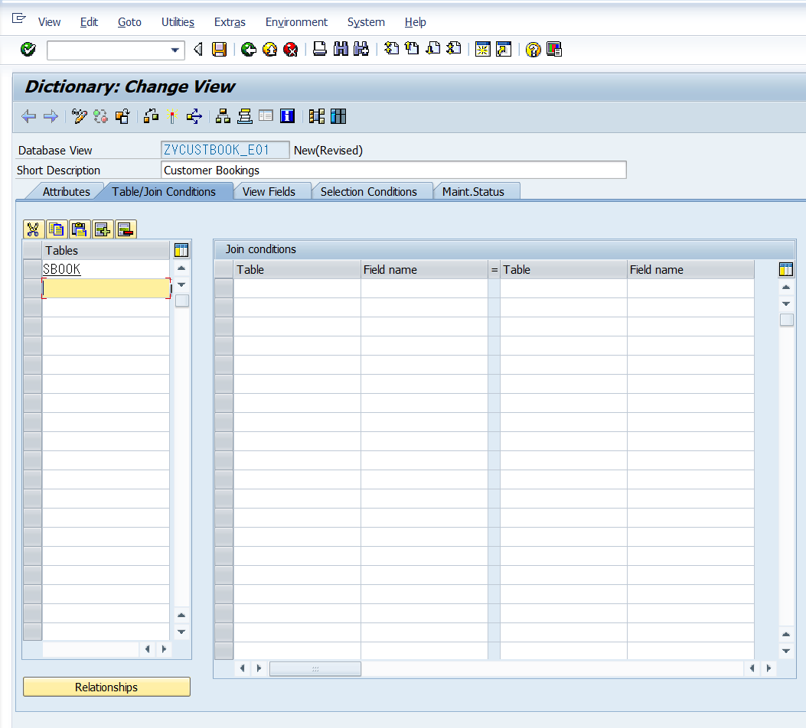
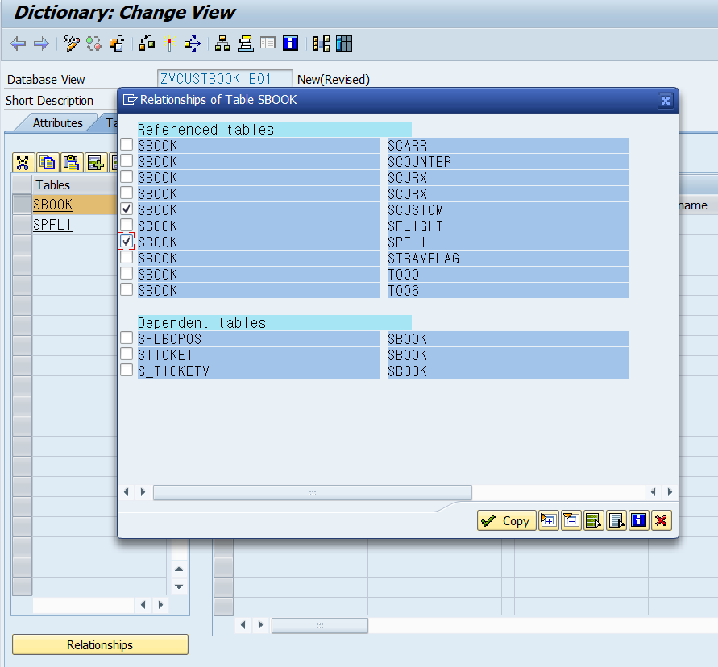
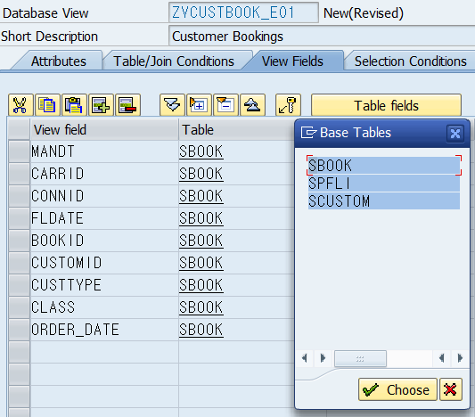
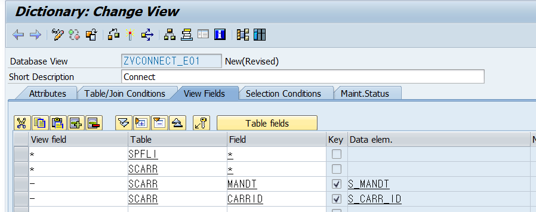

# VIEWS and Mainaenance Views
**&nbsp;&nbsp; B3.P210**  
    일반적으로 ABAP DICC의 View는 데이터 조회만 가능하다.  
    DB에서 생성한 View는 일반 View와 같이 데이터 쓰기도 가능하다.  
    
<table>
<th align = "center">뷰 이름</th>
<th align = "center">내용</th>
<th align = "center">가능한 JOIN</th>
<tr>
    <td align = "center">DB View</td>
    <td>여러 테이블을 이용하여 데이터 조회가능</td>
    <td>INNER JOIN</td>
</tr>
    <td align = "center">Projection View</td>
    <td>
        하나의 테이블을 이용한다.<br>
        필드 조회에 제한을 줄 때.<br>
        예) 사원 정보 조회 제한.<br>
    </td>
    <td>JOIN 불가</td>
</tr>
<tr>
    <td align = "center">Maintenance View</td> 
    <td>
        데이터 베이스 테이블 유지보수를 위해 사용<br>
        ENDUSER의 DB관리를 위해 존재
    </td>
    <td>INNER JOIN,<br> LEFT OUTER JOIN</td>
</tr>    
<tr>
    <td align = "center">HELP View</td> 
    <td><a href="./SAP_TAW10_ABAP DDIC_UNIT9.md">UNIT9에서 진행됨</a>
    </td>
    <td>
    </td>
</tr>                     
</table>

- 뷰 생성에는 JOIN Condition이 필요하며,  
    없다면, CROSS join이 이루어진다.

- 뷰에도 Select-Option을 이용해,  
    필요한 정보만 조회할 수도 있다.

---
## ABAP DICC VIEW 정의
**&nbsp;&nbsp; B3.P217**  
- 예시 코드 존재

DICC에 View를 미리 저장할 수 있고,  
VIEW는 테이블로 간주된다.

---
## DB VIEW 생성
**&nbsp;&nbsp; B3.P219**  

- View의 이름은 Y또는 z로 시작됨  
- 최대 15자까지 이름 설정 가능함.  
- FK가 설정된 테이블은 굳이 좌측 사용 테이블 조건에 입력하지 않아도된다.  
- ABAP DICC에서 정의한 View는   
    Program Code에서 뷰 data TYPE으로 사용된다.
 

!!실습!!  
1. zvcustbook_e01 DB VIEW 생성  
    - 
2. 좌측 탭과 하단 Relation 버튼을 이용하여 사용 테이블 입력
    - 
3. 뷰필드 선택
    - 
4. 조회 조건 선택
    - 

---
<h3 align =center><b>zabap_e02_030 실습</b></h3>

---

```abap
    cl_demo_output=>display( gt_custbook ).
     조회Function    Method ( 조회 대상   ).
```

### Dynamic VIEW FIELD 
- 동적인 뷰필드 추가  
    - 동적인 컬럼 설정을 필요로 할때에는
    - 필드명을 *로 작성하고 해당 ROW를 원하는 테이블로 선택.
    - 이 때에 중복되는 필드(KEY Field)는 꼭 필드명 - 로설정하여 제외해야한다.

- ZVCONNECT_E01
    - 
    - 필드에 \* 는 모든 필드 포함  
    - 필드에 \- 는 해당 필드 미포함  
    - 중복되는 필드는 전부 \-처리해줘야한다.

---

## MAINTENANCE VIEW 생성
**&nbsp;&nbsp; B3.P228**  
- LEFT OUTER JOIN 사용함
- FK설정된 테이블만 생성 가능함.
- MAINTENANCE DIALOG를 생성해야하는 것이 필수다. **B3.P229**  
    - 싱글 스탭 TWO 스탭 설정이 가능함.

1. DB VIEW 생성과 유사함.
    1. MAIN TABLE이 처음으로 등장해야함.
        - 1번째 테이블만 임의 입력가능하고,   
            이후 추가되는 테이블은 무조건 RELATION이 있어야함
    2. VIEW Field 설정.
2. MENU - utilities - generate maintenance Dialog 생성
    - AUTH GROUP
    - FUNCTION GROUP
        펑션 그룹 아래에 다이얼로그 생성됨.
    - STEP 회수 선택
        1. ONE STEP의 경우에는 OVERview SCREEN에만 와야함
        2. TWO STEP의 경우 전부다 필요함.
<table align ="center">
    <th>장점</th>
    <th>단점</th>
    <tr>
        <td>짧은 시간에 생성가능함</td>
        <td>비동기화 업데이트가 불가능함<br>
            NO asynchronous update
        </td>
    </tr>
    <tr>
        <td>테이터 생성 및 유지보수가 가능함.</td>
        <td>CBU table에서만 사용가능</td>
    </tr>
    <tr>
    <td>sm30에서 관리가능</td>
    </tr>
</table>

---

<h3>!!실습!!<h3>  <br>

1. ZVORG_E01_M Maintenance VIEW 생성
2. 테이블 입력 REL table 선택
3. View 필드에 KEY 필드 자동 선택됨
4. 나머지 필요한 필드를 추가

<hr>


5. Utilities - table maintenance generater
6. auth 설정
7. Function group 설정
    - 일반적으로 일반 펑션 그룹과 메인테넌스 펑션그룹을 나눠서 생성하게됨.
8. Find SCREEN NUM
    - 
    1. 1번 SYS에서 추천하는 스크린 넘버
    2. 2번 사용가능한 스크린 넘버
    3. 3번 Screen Number List 
9. F6 혹은 create 버튼 선택하여 생성
    - FUNCtion Group이 생성되어있지않았기에 FG먼저 생성됨
<hr>

10.  MAintenance VIEW 생성완료
    - SM30에서 스크린 디스플레이와 수정 가능함
    - 생성한 FG에서 해당 스크린의 소스코드도 확인가능함.


## VIEW CLUSTER 생성

